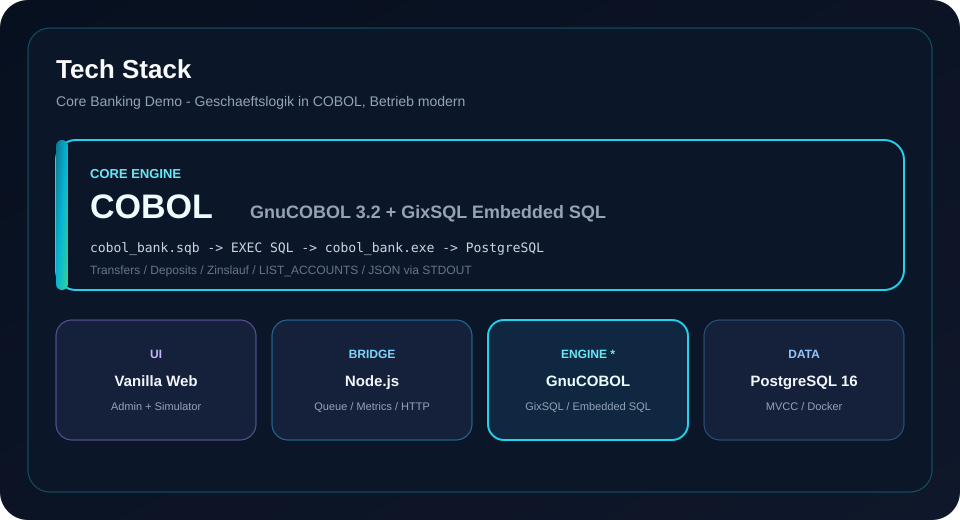
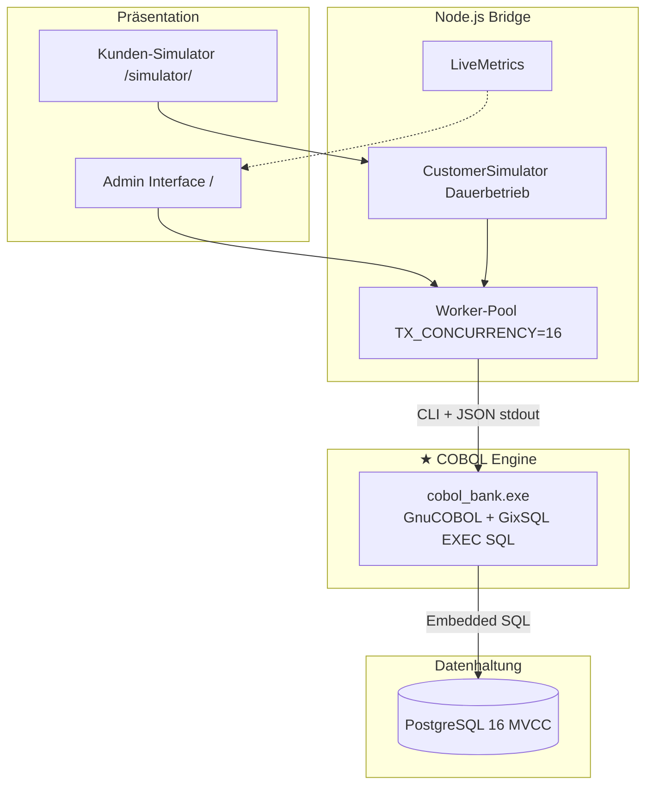
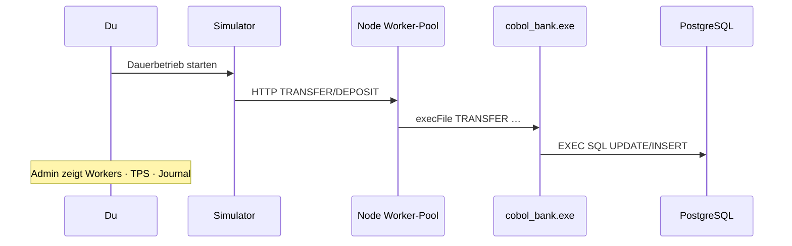

<div align="center">

# COBOL CoreBank

### Enterprise Core Banking Demo — **echte COBOL-Geschäftslogik** trifft modernen Parallelbetrieb

**GnuCOBOL 3.2** · **GixSQL Embedded SQL** · **PostgreSQL 16** · **Node.js Bridge** · **Admin UI** · **Kunden-Simulator**

[](LICENSE)
[](https://gnucobol.sourceforge.io/)
[](https://github.com/mridoni/gixsql)
[](https://www.postgresql.org/)
[](https://nodejs.org/)
[](#schnellstart)

[Live-Doku](doc/README.md) · [Architektur](doc/ARCHITECTURE.md) · [COBOL-Engine](doc/ARCHITECTURE.md#4-cobol-engine-cobol_banksqb) · [Admin](doc/ADMIN.md) · [Simulator](doc/SIMULATOR.md) · [API](doc/API.md)

<br/>



</div>

---

## Warum dieses Projekt?

Viele Banken betreiben jahrzehntealte **COBOL-Cores**. Dieses Repo zeigt praxisnah:

1. **Geschäftslogik bleibt COBOL** — Konten, Überweisungen, Einzahlungen, Zinslauf, Journal  
2. **Datenbank ist modern** — PostgreSQL 16 mit MVCC statt Single-Writer-SQLite  
3. **Betrieb ist beobachtbar** — Admin mit Live-Last, Worker-Pool, Journal; Simulator im Dauerbetrieb  

Kein Mock der Banklogik: `cobol_bank.exe` ist kompiliertes **GnuCOBOL** mit **Embedded SQL (GixSQL)**.

---

## Tech Stack (Hervorhebung COBOL)

| Schicht | Technologie | Rolle |
|---|---|---|
| **★ Engine** | **GnuCOBOL 3.2** + **GixSQL** | Gesamte Banking-Logik in `src/cobol/cobol_bank.sqb` — `EXEC SQL`, ACID-Transfers, JSON über STDOUT |
| Datenbank | **PostgreSQL 16** (Docker) | Persistenz, parallele Transaktionen (MVCC) |
| Bridge | **Node.js** (ohne schweres Framework) | Spawn COBOL-Prozesse, Worker-Pool (`TX_CONCURRENCY`), REST, LiveMetrics, Simulator |
| UI | Vanilla **HTML / CSS / JS** | Admin Interface + Kunden-Simulator (Canvas-Visualisierungen) |
| Build / Ops | `gixpp` → `cobc`, Docker Compose, `.bat`-Starter | Windows-Demo-Setup |

### Was COBOL konkret macht

| Paragraph / Action | Bedeutung |
|---|---|
| `INIT` | Schema (`accounts`, `transactions`) + Seed-Konten |
| `LIST_ACCOUNTS` / `LIST_TRANSACTIONS` | Cursor + JSON für Admin/API |
| `TRANSFER` | Atomare Debit/Credit-Updates + Summenerhaltungsprüfung + Journal |
| `DEPOSIT` | Gutschrift + Journal |
| `CALC_INTEREST` | Batch-Verzinsung (`balance = balance + Zins`) |
| `CREATE_ACCOUNT` | Kontoanlage mit SQLCODE-Prüfung |

Quelle: [`src/cobol/cobol_bank.sqb`](src/cobol/cobol_bank.sqb) → Build → [`bin/cobol_bank.exe`](bin/)

<p align="center">
  
</p>



---

## Screenshots / Konzeptgrafiken

| Admin — Last & Parallelbetrieb | Simulator — Dauerbetrieb |
|---|---|
|  |  |

- **Admin:** Konten, Audit-Journal (live), Worker-Pool, TPS, Stress-Test, COBOL Inspector  
- **Simulator:** Dauerbetrieb (Loop), Mix **Betrieb** (~55 % Transfer / 35 % Deposit), echte PostgreSQL-Writes  

---

## Schnellstart

**Voraussetzung:** [Docker Desktop](https://www.docker.com/products/docker-desktop/) · [Node.js](https://nodejs.org/) · **GnuCOBOL 3.2** inkl. GixSQL + PostgreSQL-Treiber (Windows).

| Aktion | Befehl | URL |
|---|---|---|
| **Admin** | `startadmin.bat` | http://127.0.0.1:3000/ |
| **Simulator** | `startsimmulator.bat` | http://127.0.0.1:3000/simulator/ |
| **Stop Backend** | `stop.bat` | — |

```text
startadmin.bat
  ├─ Docker: PostgreSQL 16 (cobol / cobol / cobolbank @ :5432)
  ├─ gixpp + cobc → bin/cobol_bank.exe   ← COBOL-Build
  ├─ node backend/server.js  (COBOL INIT)
  └─ Browser → Admin UI
```

> Starter: `startadmin.bat` · `startsimmulator.bat` · `stop.bat`  
> Postgres stoppen: `docker compose down`

---

## Demo in 5 Minuten

1. `startadmin.bat` — Demokonten & KPIs  
2. `startsimmulator.bat` — Preset **Produktion** (Dauerbetrieb, Mix Betrieb)  
3. Im Admin: Worker-Pool, TPS, Journal zählen hoch  
4. Im Simulator: Orbit + Event-Feed mit echten `TRANSFER` / `DEPOSIT`  



---

## COBOL CLI (ohne UI)

```cmd
powershell -ExecutionPolicy Bypass -File .\scripts\build_cobol.ps1
.\bin\cobol_bank.exe INIT
.\bin\cobol_bank.exe LIST_ACCOUNTS
.\bin\cobol_bank.exe TRANSFER DE89370400440532013000 DE89370400440532013001 10.00 "Demo"
.\bin\cobol_bank.exe DEPOSIT DE89370400440532013000 50.00 "Cash"
.\bin\cobol_bank.exe CALC_INTEREST
```

DSN: `pgsql://127.0.0.1:5432/cobolbank?native_cursors=off` · User/Pass: `cobol` / `cobol`

---

## REST API (Kurz)

| Methode | Pfad | Zweck |
|---|---|---|
| GET | `/api/accounts` | Konten (via COBOL) |
| GET | `/api/transactions` | Journal (`total_transactions` + letzte 200) |
| POST | `/api/transfer` / `/api/deposit` | Schreibende COBOL-Jobs |
| POST | `/api/simulate/start` | Batch oder `continuous: true` |
| GET | `/api/system-status` | Queue, LiveMetrics, Simulator |

Vollständig: **[doc/API.md](doc/API.md)**

---

## Tests

```cmd
npm test                 # Unit (Mock) + Integration (Server muss laufen)
npm run test:unit
npm run test:integration
```

Prüft u. a. Dauerbetrieb-Writes und dass `system-status` Worker/Clients/TPS fürs Admin-UI liefert.

---

## Projektstruktur

```text
cobol-corebank/
├── src/cobol/cobol_bank.sqb     ★ COBOL + EXEC SQL (Herzstück)
├── scripts/build_cobol.ps1      # gixpp + cobc
├── bin/cobol_bank.exe           # gebaute Engine
├── backend/server.js            # API, Worker-Pool, Metrics
├── backend/simulator.js         # Dauerbetrieb / Batch
├── frontend/                    # Admin + Simulator
├── tests/                       # node:test Suite
├── docker-compose.yml           # PostgreSQL 16
├── doc/                         # Architektur, Ops, API, …
└── startadmin.bat / startsimmulator.bat / stop.bat
```

---

## Dokumentation

| Dokument | Inhalt |
|---|---|
| [doc/README.md](doc/README.md) | Inhaltsverzeichnis |
| [doc/ARCHITECTURE.md](doc/ARCHITECTURE.md) | Schichten, **COBOL-Engine**, Schema, Concurrency |
| [doc/ADMIN.md](doc/ADMIN.md) | Admin UI & Telemetrie |
| [doc/SIMULATOR.md](doc/SIMULATOR.md) | Dauerbetrieb, Mix Betrieb, Live-Feed |
| [doc/API.md](doc/API.md) | REST-Referenz |
| [doc/OPERATIONS.md](doc/OPERATIONS.md) | Start, Build, Tests, Troubleshooting |
| [doc/CODE_REVIEW.md](doc/CODE_REVIEW.md) | Review-Findings |

### Grafiken im Repo

| Datei | Motiv |
|---|---|
| [doc/assets/tech-stack.svg](doc/assets/tech-stack.svg) | Tech Stack — COBOL hervorgehoben |
| [doc/assets/architecture.svg](doc/assets/architecture.svg) | End-to-End-Architektur |
| [doc/assets/admin-preview.svg](doc/assets/admin-preview.svg) | Admin Last-Studio |
| [doc/assets/simulator-preview.svg](doc/assets/simulator-preview.svg) | Simulator Aktivitätsraum |

---

## Hinweise (GixSQL / Demo)

- DSN: **`native_cursors=off`** · kein `FOR UPDATE` (Precompiler) · Timestamps via `CAST(… AS VARCHAR(25))`  
- Parallelität: `TX_CONCURRENCY` (Default **16** parallele COBOL-Prozesse)  
- Demo bindet default auf `127.0.0.1` (keine Auth)  
- Transfer-Konflikte unter Last sind erwartbar (Summenerhalt / parallele Debits)

---

## Lizenz

MIT — Demo- und Lernprojekt. Siehe [LICENSE](LICENSE).
