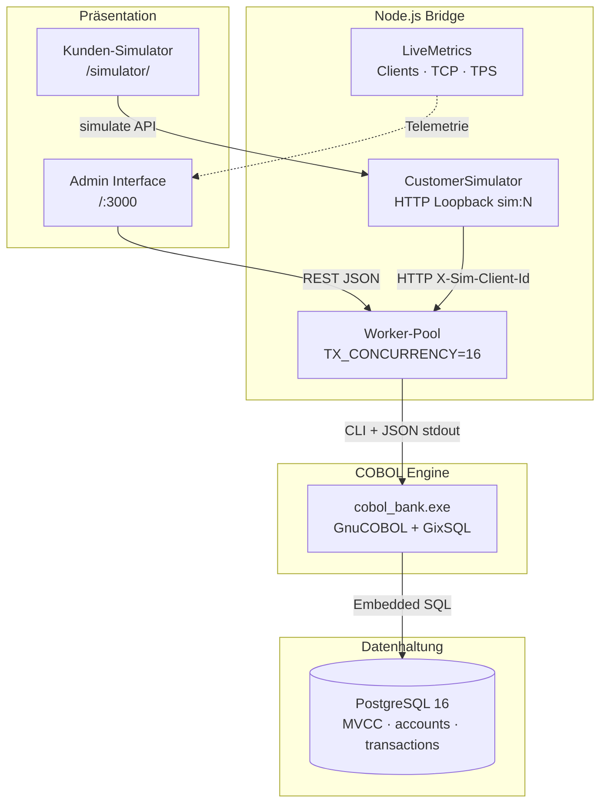
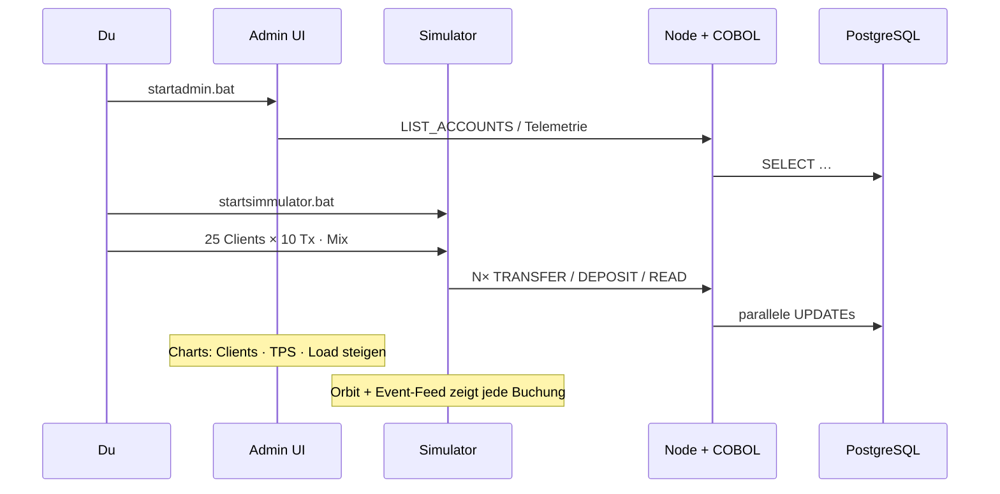
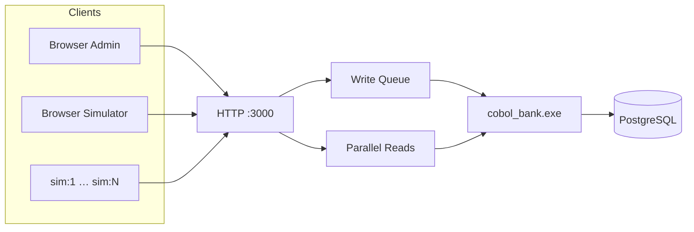

<div align="center">

# COBOL CoreBank

### Enterprise Core Banking Demo — Mainframe-Logik trifft modernen Parallelbetrieb

**GnuCOBOL 3.2** · **GixSQL Embedded SQL** · **PostgreSQL 16** · **Admin UI** · **Kunden-Simulator**

[](LICENSE)
[](https://gnucobol.sourceforge.io/)
[](https://www.postgresql.org/)
[](#schnellstart)

[Dokumentation](doc/README.md) · [Architektur](doc/ARCHITECTURE.md) · [Admin](doc/ADMIN.md) · [Simulator](doc/SIMULATOR.md) · [API](doc/API.md)

</div>

---

## Was ist das?

**COBOL CoreBank** ist ein vollständiges **Demo- und Referenzprojekt** für Core Banking:

Die gesamte Geschäftslogik (Konten, Überweisungen, Einzahlungen, Zinslauf) läuft in **echtem COBOL** mit Embedded SQL — wie auf dem Mainframe. Darüber sitzen ein schlankes **Node.js-Backend**, ein professionelles **Admin Interface** mit Live-Lastgrafiken und ein **Kunden-Simulator**, der N parallele Bankkunden gegen die API schickt.

Ziel: zeigen, dass klassische COBOL-Bankenlogik mit **PostgreSQL-MVCC** und parallelen Workern modern und beobachtbar betrieben werden kann.



---

## Highlights

| Bereich | Was du siehst |
|---|---|
| **COBOL Core** | Atomare Transfers (`balance = balance ± amount`), Deposits, Zinsbatch, JSON über STDOUT |
| **PostgreSQL** | Echter Parallelbetrieb statt SQLite-FIFO — Docker Compose One-Click |
| **Admin** | Konten, Audit-Journal, Stress-Test, COBOL Inspector, **Realtime Serverlast-Studio** |
| **Simulator** | N parallele Kunden, Orbit-Animation, Event-Feed „was gerade passiert“, Client-Karten |
| **Telemetrie** | Aktive Clients, TCP-Verbindungen, TPS, Queue-Worker, Load Index |

<p align="center">
  
</p>

---

## Schnellstart

**Voraussetzung:** [Docker Desktop](https://www.docker.com/products/docker-desktop/) (PostgreSQL) · Node.js · GnuCOBOL 3.2 inkl. GixSQL/PostgreSQL-Treiber (Windows).

| Aktion | Befehl | Öffnet |
|---|---|---|
| **Admin Interface** | `startadmin.bat` | http://localhost:3000/ |
| **Kunden-Simulator** | `startsimmulator.bat` | http://localhost:3000/simulator/ |
| **Stop Backend** | `stop.bat` | — |

```text
startadmin.bat
  ├─ Docker: PostgreSQL 16 (cobol / cobol / cobolbank @ :5432)
  ├─ Build cobol_bank.exe falls nötig (gixpp + cobc)
  ├─ node backend/server.js  (INIT-Schema)
  └─ Browser → Admin UI
```

> `start.bat` = Alias auf Admin · `startsimulator.bat` = Alias auf Simulator

PostgreSQL später stoppen: `docker compose down`

---

## Demo-Szenario (5 Minuten)



1. Admin starten — Demokonten und KPIs prüfen  
2. Simulator öffnen — Preset **Mittel** oder **Stark**  
3. Im Admin das **Serverlast-Studio** beobachten (Charts/Gauges)  
4. Im Simulator den **Live-Feed** und die Client-Karten verfolgen  

---

## Architektur im Überblick



| Schicht | Technologie | Verantwortung |
|---|---|---|
| UI | Vanilla HTML/CSS/JS | Admin + Simulator, Canvas-Visualisierungen |
| API | Node.js (ohne schwere Frameworks) | Spawn COBOL, Queue, Metrics, Simulate |
| Engine | GnuCOBOL + GixSQL | Banking-Paragraphs, ACID-SQL |
| DB | PostgreSQL 16 Alpine | MVCC, Persistenz |

Details: **[doc/ARCHITECTURE.md](doc/ARCHITECTURE.md)**

---

## Admin Interface


- Kontenverwaltung & Buchungsjournal (Audit)
- Überweisung / Einzahlung / Zinslauf
- Live: Clients · Verbindungen · TPS
- **Serverlast-Studio:** Multi-Series-Chart, Gauges, Partikel, Load Index
- COBOL Core Inspector (letztes CLI + stdout)
- Link zum Simulator

→ [doc/ADMIN.md](doc/ADMIN.md)

---

## Kunden-Simulator


- Einstellbare **N parallele Kunden** und Tx/Kunde
- Mix: Gemischt / Transfer / Deposit / Read
- Echte HTTP-Loopback-Requests mit `X-Sim-Client-Id`
- Orbit-Animation, TPS-Sparkline, Event-Feed, Client-Grid

```cmd
startsimmulator.bat
```

→ [doc/SIMULATOR.md](doc/SIMULATOR.md)

---

## COBOL CLI (direkt)

Nach Build (`scripts/build_cobol.ps1`):

| Action | Beispiel |
|---|---|
| Init | `.\bin\cobol_bank.exe INIT` |
| Konten | `.\bin\cobol_bank.exe LIST_ACCOUNTS` |
| Transfer | `.\bin\cobol_bank.exe TRANSFER <IBAN_FROM> <IBAN_TO> 10.00 "Demo"` |
| Deposit | `.\bin\cobol_bank.exe DEPOSIT <IBAN> 50.00 "Cash"` |
| Zinsen | `.\bin\cobol_bank.exe CALC_INTEREST` |

DSN: `pgsql://127.0.0.1:5432/cobolbank?native_cursors=off` · Auth: `cobol.cobol`

---

## REST API (Kurz)

| Methode | Pfad | Zweck |
|---|---|---|
| GET | `/api/accounts` | Konten + Liquidität |
| GET | `/api/transactions` | Journal |
| POST | `/api/transfer` | Überweisung |
| POST | `/api/deposit` | Einzahlung |
| POST | `/api/simulate/start` | Simulator starten |
| GET | `/api/simulate/status` | Stats + Clients + Events |
| GET | `/api/system-status` | Queue + LiveMetrics |

Vollständig: **[doc/API.md](doc/API.md)** · Betrieb: **[doc/OPERATIONS.md](doc/OPERATIONS.md)**

---

## Projektstruktur

```text
cobol-corebank/
├── startadmin.bat / startsimmulator.bat / stop.bat
├── docker-compose.yml          # PostgreSQL 16
├── backend/
│   ├── server.js               # API, Queue, Metrics
│   └── simulator.js            # N parallele Kunden
├── frontend/
│   ├── index.html              # Admin
│   ├── js/load-viz.js          # Last-Charts
│   └── simulator/              # Simulator UI + Viz
├── src/cobol/cobol_bank.sqb    # COBOL + EXEC SQL
├── scripts/build_cobol.ps1
└── doc/                        # Vollständige Dokumentation
```

---

## Dokumentation

| Dokument | Inhalt |
|---|---|
| [doc/README.md](doc/README.md) | Inhaltsverzeichnis |
| [doc/ARCHITECTURE.md](doc/ARCHITECTURE.md) | Schichten, COBOL, Schema, Concurrency |
| [doc/ADMIN.md](doc/ADMIN.md) | Admin UI & Telemetrie |
| [doc/SIMULATOR.md](doc/SIMULATOR.md) | Simulator & Live-Feed |
| [doc/API.md](doc/API.md) | REST-Referenz |
| [doc/OPERATIONS.md](doc/OPERATIONS.md) | Start, Build, Troubleshooting |

---

## Hinweise für Entwickler / KI

- GixSQL: **`native_cursors=off`**, keine Bindestriche in SQL-Hostvariablen, kein `FOR UPDATE` (Precompiler-Bug)
- Timestamps: `CAST(created_at AS VARCHAR(25))` statt `TO_CHAR(…:MI…)`
- Parallelität: `TX_CONCURRENCY` (Default 16)
- Demo-Credentials nur für lokale Entwicklung (`cobol`/`cobol`)

---

## Lizenz

MIT — siehe Projektroot. Demo-Projekt zu Lern- und Demonstrationszwecken.
